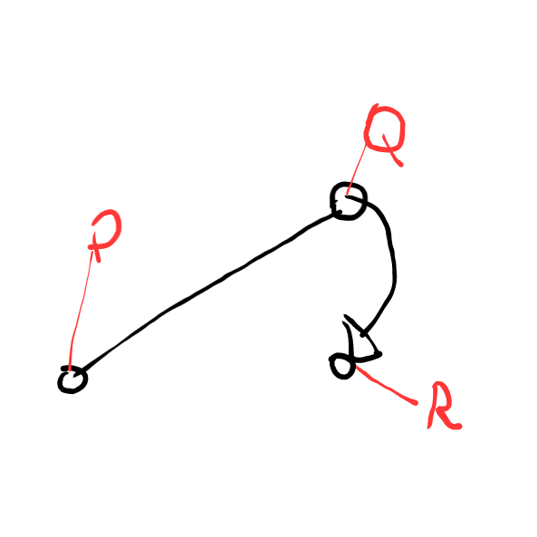
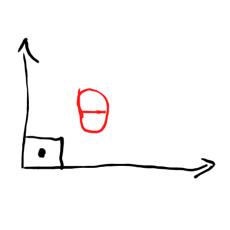
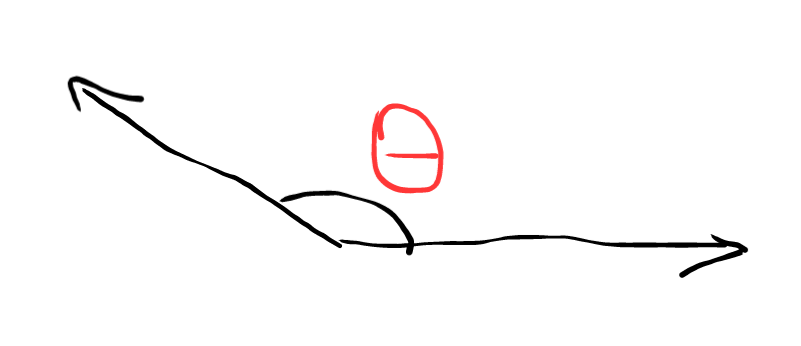

# Geometria Computacional

## Ponto

Todas as notações ultilizam double, o que pode ser adaptado dependendo da questão.

### Classe Ponto
```c++
const double EPS = 1e-9;
struct Point{
    double x;
    double y;

    Point(double a, double b) : x(a), y(b) {} ;
    Point() : x(0), y(0) {} ;

    bool operator <(const Point& a){
        if (fabs(x-a.x)<EPS) // Se x==x
            return (y<a.y+EPS) and (y<a.y-EPS); //y<y
        else
            return (x<a.x+EPS) and (x<a.x-EPS); // x<x
    }
    bool operator ==(const Point& a){  
        return fabs(x-a.x)<EPS && fabs(y-a.y)<EPS;
    }
    double distance(Point a){
        return hypot(x-a.x, y-a.y);
    }

};

```

### Discriminante entre 3 pontos



- dis=0 caso R pertença ao plano
- dis=1 caso R esteja no semiplano à **esquerda** da reta
- dis=-1 caso R esteja no semiplano à **direita** da reta

```c++
int dis(Point p, Point q, Point r){
    double ans = (p.x*q.y+p.y*r.x+q.x*r.y)-(r.x*q.y+r.y*p.x+q.x*p.y);
    if(fabs(ans)<EPS) return 0;
    else if(ans>0) return 1;
    else return -1;
}

```
## Vetores

### Classe
A representação de vetores é igual a de ponto, porém com diferentes funções
```c++
struct Vector{
    double x;
    double y;
    Vector(double a, double b) : x(a), y(b) {};
    Vector(): x(1), y(1) {};

    //Apenas se a classe ponto estiver emplementada
    // Vetor de A apontando para B
    Vector(Point a, Point b){
        x = b.x-a.x;
        y = b.y-a.y;
    }; 

    double size(){
        return hypot(x, y);
    }
    double ang(){
        return atan2(y, x);
    }
    void rotate(double theta){
        double r = size();
        double w = ang();
        x = r*cos(w-theta);
        y = r*sin(w-theta);
    }
    void rotate(Point c, double theta){
        x-=c.x; y-=c.y;
        rotate(theta);
        x+=c.x; y+=c.y;
    }
};
```
<br>
<br>

### Produto interno entre 2 vetores

- produto interno=0 Vetores ortogonais

 

- produto interno=0 Ângulo obtuo 

 

- produto interno=0 Ângulo agudo


```c++
double inter_prod(Vector u, Vector v){
    return u.x*v.x+u.y*v.y;
}
```

### Angulo entre 2 vetores 

```c++
const double EPS = 1e-9;
const double PI = acos(-1);

double ang(Vector u, Vector v){
    double p = inter_prod(u, v);
    if(fabs(p)<EPS) return PI;
    else return acos(p/(u.size()*v.size()));
}
```

<br>
<br>
<br>
<br>
<br>
<br>
<br>
<br>
<br>


## Reta

### Classe
A equação da reta mostrada abaixo se refere a ax+by+c=0
- Classe reta
```c++
struct Line{
    double a;
    double b;
    double c;

    Line() : a(1), b(1), c(1) {};
    //Apenas se a classe ponto estiver emplementada
    Line(Point p, Point q){
        a = p.y-q.y;
        b = q.x-p.x;
        c = p.x*p.y-q.x*p.y;
    }
    
    double fx(double x){
        return -(a*x+c)/b;
    }

    double fy(double y){
        return -(b*y*c)/a;
    }

};
```

<br>
<br>
<br>
<br>
<br>
<br>
<br>
<br>
<br>
<br>
<br>
<br>
<br>
<br>
<br>
<br>
<br>


## Círculo

- Classe círculo

As funções definidas abaixo se referem ao argo, corda, setor e segmento do círculo respectivamente.
```c++
const double PI = acos(-1);

struct Circle{
    double r;
    double x;
    double y;
    
    double arc(double ang){
        return ang*r;
    }

    double chord(double ang){
        return 2*PI*sin(ang/2);
    }

    double sector(double ang){
        return ang*r*r/2;
    }

    double segment(double ang){
        double s = sector(ang);
        double c = chord(ang);
        return sqrt((s-r)*(s-r)*(s-c));
    }

};
```